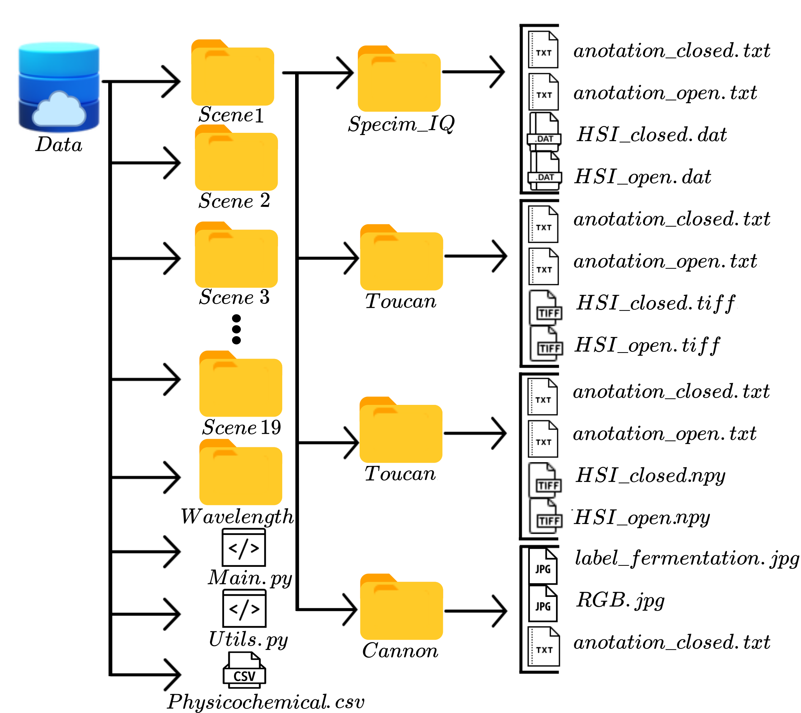

# Spectral_cacao_beans

Dataset available at: [Spectral Cocoa Beans Dataset](https://huggingface.co/datasets/kebincontreras/Spectral_cocoa_Beans/tree/main)

@misc {kebin_andres_contreras_2025,
	author       = { {Kebin Andres Contreras} },
	title        = { Regression_cocoa_beans (Revision 2bb89ec) },
	year         = 2025,
	url          = { https://huggingface.co/datasets/kebincontreras/Regression_cocoa_beans },
	doi          = { 10.57967/hf/4846 },
	publisher    = { Hugging Face }
}

## Project Structure

### Instructions

1. Clone this repository.
2. Download the `data` folder from Hugging Face and ensure it matches the structure shown in the image above.

### Execution

When running the `main` script, it generates:
- Plots of the average spectral signatures from local labels of each camera for both open and closed dry cocoa beans.
- PCA analysis by scene.

